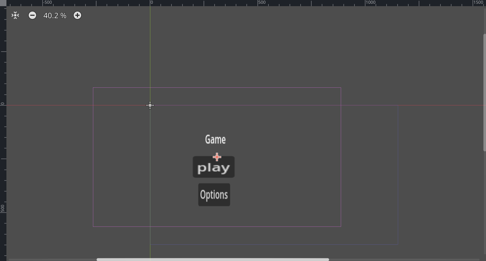
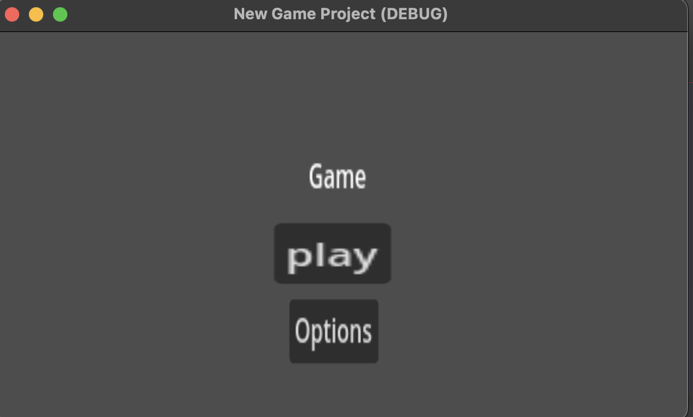

# Entry 3
##### 2/05/2025

### Content
Over the past month, I have been learning how to make 
game menus and UI in godot. Before starting, I watched a [video](https://www.youtube.com/watch?v=vsKxB66_ngw) about how to make 
buttons and text in godot. 
At first, I created a control node in the main scene that will serve as the game's main menu.
I planned to attach a script to the button in order to load the game scene. 

```c#
using Godot;
using System;

public partial class Button : Godot.Button
{
	// Called when the node enters the scene tree for the first time.
	public override void _Ready()
	{
	}

	// Called every frame. 'delta' is the elapsed time since the previous frame.
	public override void _Process(double delta)
	{
	}
}
```
Using the script that Godot automatically generated when creating a new attached script to a button,
I realized that there is a method that does something at the start and another when the mouse is hovered. However, there was no method for things to run when the button is pressed.
I decided to check the [godot documentation](https://docs.godotengine.org/en/stable/classes/class_button.html) and found the on click method to add to the `Button` class. 
```c#
 private void OnButtonPressed()
   {
   }
```

The next thing I've tried is creating a start menu. At first, I've tried to create a few button and label nodes(for text). I found out that you can just move the nodes in the 2d coordinate plane. 

I ran the game when I finished creating a simple start menu and The camera was centered at the axes of the 2d coordinate plane.

I looked around and found on the [godot forum](https://godotforums.org/d/33200-how-to-get-the-center-of-the-screen) to add a camera node to the control node.

When I ran the game again, the camera was centered around the buttons.


I plan on learning how to create moving tiles that act like some sort of obstacle the player has to avoid.


### EDP
I am still currently on step 3 of the engineering design process where Godot to find out how to create the game through watching [walkthroughs](https://www.youtube.com/watch?v=vsKxB66_ngw)
and reading [documentation](https://docs.godotengine.org/en/3.0/getting_started/step_by_step/ui_main_menu.html) to learn how to create different things in Godot such as UI or scenes. My next step is to plan the most possible solution through combining all the child nodes I've created.

### Skills
I continue to develop on debugging and How to read throughout the process of using Godot. For debugging, I've used the Rider IDE's built in debugger to spot errors. I also had to read a lot of godot documentation to find certain features such as the `onButtonPressed()` method for the `Button`
 class.

[Previous](entry02.md) | [Next](entry04.md)

[Home](../README.md)