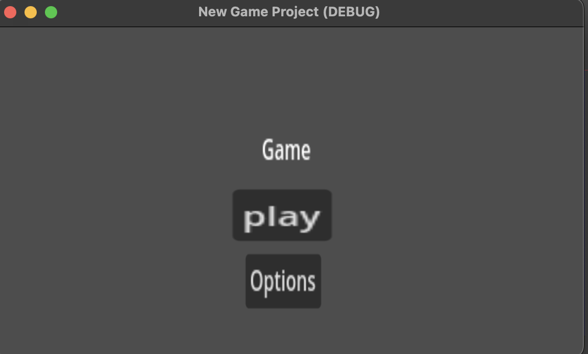

# Entry 4
##### 3/12/25

### Content

During the past few weeks, I've been slowly creating a mvp of my game. I created a simple start menu that would load the game scene when play was pressed.


This has been the file tree I have finished so far with the Control node containing all the components for the start menu. One of the buttons has a scrip attached that would load the main node when the button was pressed
```c#
public class MyButton : Button
{
public override void _Ready()
{
  // blank but is required method
}

private void OnButtonPressed() {
  Scene.load("main");
}
}
```
I have also added controls to the player node so that the player could be moved with basic controls
```
using Godot;
public partial class Player : CharacterBody2D
{
    public override void _Ready()
    {
        Position = new Vector2(0, 0);  
    }

    public override void _PhysicsProcess(double delta)
    {
        Vector2 velocity = Vector2.Zero;

        if (Input.IsActionPressed("move_right"))
            velocity.X += 1;
        if (Input.IsActionPressed("move_left"))
            velocity.X -= 1;
        if (Input.IsActionPressed("move_down"))
            velocity.Y += 1;
        if (Input.IsActionPressed("move_up"))
            velocity.Y -= 1;
    }
}
```
The only thing left to complete my mvp is the finish creating the tile map which requires me to find a tile asset pack and build it.

### EDP
I am on step 5 of the Engineering Design process where i am creating the minimum viable product which in this case is a game with one simple level.
I had spent a few hours per week creating the different nodes needed such as the player node that contains the sprite and a script that adds movement controls and a camera centered to it. My next step is to test and evaluate the prototype which is play testing the game to make sure eveything works right. I will also have to fix any potential bugs or unintended features.

### Skills
I continued to develop time management and how to google. Since this project is done on my own time, I would need to set aside some time every week to work on this. So far, I spent around 3 hours every week working on this project. The game uses Godot which has a lot of requires online and because we are learning it our own, I learned how to find out how to do a lot of things in Godot such as how to add controls to player node. Using google, I found [a video guide](https://www.youtube.com/watch?v=KfydpMuTBvA) that shows how to use the control node. 


[Previous](entry03.md) | [Next](entry05.md)

[Home](../README.md)