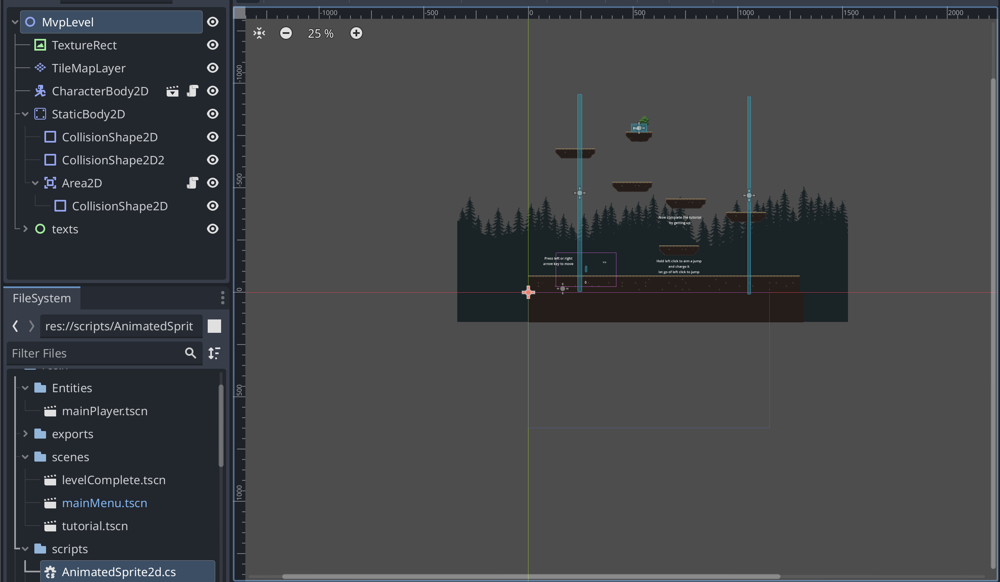

# Entry 5
##### 4/24/25

Content 
During the past few weeks, I have been working on my mvp.
Connecting godot scripts to Rider, I managed to create a jumping and gravity feature:
```c#
using Godot;

public partial class MainPlayer : CharacterBody2D
{
private Line2D _line;
private bool _isAiming;
private AnimatedSprite2D _playerLocation;
private Label _multiplierLabel;
private Vector2 _targetAim;
private bool _isJumping;
private Timer _timer;

	private const float Speed = 100.0f;
	private const float JumpPower = 350.0f;
	private int _multiplier = 1;
	
	public override void _Ready()
	{
		AddToGroup("player");
		
		_line = GetNode<Line2D>("Line2D");
		_line.Visible = false;
		
		_playerLocation	= GetNode<AnimatedSprite2D>("AnimatedSprite2D");
		_multiplierLabel = GetNode<Label>("Label");
		
		_timer = GetNode<Timer>("Timer");
		_timer.Timeout += OnMultiplierTimeout;
	}
	
	private void OnMultiplierTimeout()
	{
		if (_multiplier >= 100) return;
		_multiplier++;
		_multiplierLabel.Text = _multiplier.ToString();
	}

	
	private float _angle;
	public override void _Process(double delta)
	{
		// prevents double leaps/jumps
		if (!IsOnFloor()) return;
		
		bool wasAiming = _isAiming;
		if (Input.IsMouseButtonPressed(MouseButton.Left))
		{
			if (!_isAiming)
			{
				_timer.Start();
			}

			
			_isAiming = true;
			_line.Visible = true;
			_multiplierLabel.Visible = true;
			
			// I got claude to do the calculations to get the angle of the player to the mouse 
			
			// Get the mouse position in global coordinates
			Vector2 mouseGlobalPos = GetGlobalMousePosition();
        
			// Get the player's sprite position in local coordinates
			Vector2 playerSpritePos = _playerLocation.Position;
        
			// Calculate direction from player sprite to mouse
			Vector2 direction = mouseGlobalPos - (GlobalPosition + playerSpritePos);
        
			// Store this direction for jumping
			_targetAim = direction;
        
			// For the line, convert the mouse position to local coordinates
			Vector2 localMousePos = ToLocal(mouseGlobalPos);
        
			// The line should start at the player sprite position
			_line.Points = new []{ playerSpritePos, localMousePos };
		}
		else
		{
			// resets launch/jump force multiplier and hides the line if left click is let go
			if (_isAiming)
			{
				_timer.Stop();
			}
			
			_isAiming = false;
			_line.Visible = false;
			_multiplierLabel.Visible = false;
			

		}
    
		if (!wasAiming || _isAiming) return;
		// does angle calculation things and launch the player once left click is let go
		Vector2 jumpDirection = _targetAim.Normalized();
        
			
		Velocity = jumpDirection * (JumpPower * (1 + _multiplier / 100.0f));
		// GD.Print($"jumping multiplier: {_multiplier}, velocity: {Velocity}");

		_isJumping = true;
		_multiplier = 0;
		_multiplierLabel.Text = "0";

	}
	public override void _PhysicsProcess(double delta)
	{
		Vector2 velocity = Velocity;

		if (!IsOnFloor())
		{
			// Only apply gravity to Y axis, preserve X momentum during jumps
			velocity.Y += GetGravity().Y * (float)delta;
		}
		else
		{
			// set check for jumping to false when the player hit the ground
			if (_isJumping)
			{
				_isJumping = false;
			}
		}

		// According to the godot forums, this should allow for horizontal movement even when the player is on the ground
		if (!_isJumping || IsOnFloor())
		{
			Vector2 direction = Input.GetVector("ui_left", "ui_right", "ui_up", "ui_down");
			if (direction != Vector2.Zero)
			{
				
				velocity.X = direction.X * Speed;

				
			}
			else if (IsOnFloor())
			{
				// decelerates, creates a sliding effect based on the player's momentum. 
				velocity.X = Mathf.MoveToward(Velocity.X, 0, Speed * 0.1f); 
			}
		}

		Velocity = velocity;
		MoveAndSlide();
	}
}

```
The player will leap toward the direction the mouse is pointed at. The game will pull the player down if the player is not standing in a tile with a hitbox.

I have also created a tile level with tiles. I was able to find out how to paint some tiles to make them able to collide and interactive in different physics layer.


### Skills
I continue to develop how to google and debugging. Godot's script editor does not have a debugger built in which meant problems are not known until everything compiles. I also found out that Rider has godot support for c#. Google's AI overview shown that I could go to godot's project settings > external editor and set it to Rider.
With this, I was able to create the jumping and gravity feature for the character sprite. The debugger also has intellisense which tells me what the method does as well as the return type if it is not void. It also helped me implement some features such as suggesting certain methods that were not mentioned in the godot documentation. Rider also detected bugs that I did not spot such as an infinite for loop or an unreachable statement due to an early return. 

### EDP
I am on step 6 of the EDP where I built and tested my MVP. I built the bare minimum required for gameplay which contains movement controls, a jumping and pyshcis mechanic as well as an interactive tilemap that detects collisions. My next step is to improve which involves adding animations and more levels. I plan to include more tile packs for more levels.


[Previous](entry04.md) | [Next](entry06.md)

[Home](../README.md)